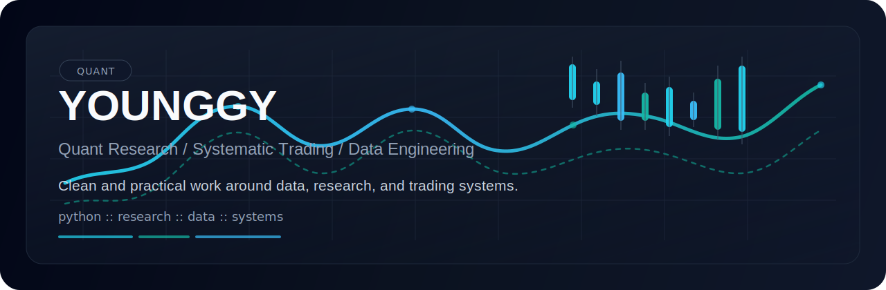

<p align="center">
  
</p>

<h1 align="center">Younggy / Tuxima</h1>

<p align="center">
  Quant Research • Systematic Trading • Data Engineering
</p>

<p align="center">
  
  
  
</p>

<p align="center">
  
  
</p>

## About

```yaml
name: Younggy
alias: Tuxima
role: Quant researcher
base: Shanghai, China
focus:
  - quantitative research
  - systematic trading
  - data engineering
preferences:
  - simple
  - reproducible
  - pragmatic
```

Interested in building reliable research workflows and clean data foundations for quant-related work.

## Toolkit

<p>
  
  
  
  
  
  
  
</p>

## GitHub

<p align="center">
  
  
</p>
